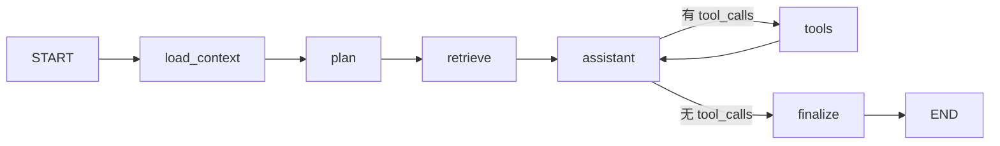
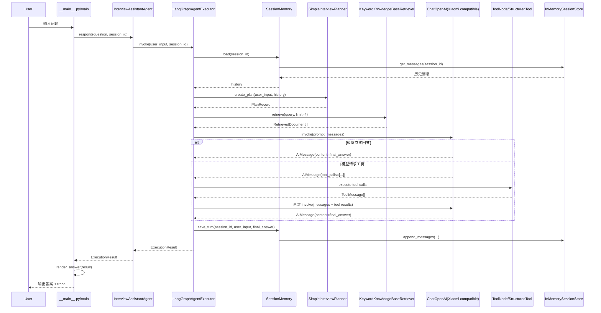

# Interview Assistant Agent 工作流拆解

这份文档对应当前仓库里的真实实现，目的是帮助你理解这条命令在代码内部是如何流转的：

```bash
uv run eka-demo --question "请帮我准备一段关于 LangGraph Agent 设计的面试回答"
```

重点回答 4 个问题：

1. 请求从哪里进入？
2. `Agent` / `Executor` / `Planner` / `Retriever` / `Tool` / `Memory` 各自负责什么？
3. `LangGraph` 的节点是怎么串起来的？
4. 每一步输入什么、输出什么、由哪个函数完成？

---

## 1. 一句话先看全局

当前项目的主链路可以概括为：

**CLI 接收问题 → 创建 Agent → Agent 调用 LangGraph Executor → 加载会话历史 → 生成计划摘要 → 检索知识库 → 调用 LLM 决策是否用工具 → 如需则执行工具 → 汇总最终答案 → 写回 Memory → CLI 渲染结果**

---

## 2. 总体结构图

```mermaid
flowchart TD
    A[用户在命令行输入问题] --> B[`src/eka/__main__.py` -> `main()`]
    B --> C[`create_interview_agent()`]
    C --> D[`InterviewAssistantAgent.create_default()`]
    D --> E[加载 Settings]
    D --> F[构建 Chat Model<br/>`build_chat_model()`]
    D --> G[构建 Memory / Planner / Retriever / Tools]
    D --> H[创建 `LangGraphAgentExecutor`]
    H --> I[`invoke()`]

    I --> J[`_load_context()`]
    J --> K[`_plan()`]
    K --> L[`_retrieve()`]
    L --> M[`_assistant()`]

    M --> N{LLM 是否返回 tool_calls?}
    N -- 否 --> O[`_finalize()`]
    N -- 是 --> P[`ToolNode` 执行工具]
    P --> M

    O --> Q[`ExecutionResult`]
    Q --> R[`render_answer()`]
    R --> S[命令行输出 Plan / Docs / Tool Calls / Answer / Trace]
```

---

## 3. 从命令行开始：入口怎么进来

文件：`src/eka/__main__.py`

### 3.1 `main()`

这是 CLI 主入口。

#### 作用
- 解析命令行参数
- 创建 Agent
- 如果传了 `--question`，就直接进行一次问答
- 否则进入交互模式

#### 关键代码路径
- `build_parser()`：定义 `--question` 和 `--session-id`
- `create_interview_agent()`：构建默认 Agent
- `agent.respond(...)`：正式进入 Agent 工作流
- `render_answer(result)`：把结果渲染成可读文本

#### 输入
- `--question`
- `--session-id`

#### 输出
- 终端上的结构化输出，包括：
  - Plan Summary
  - Retrieved Docs
  - Tool Calls
  - Answer
  - Trace

### 3.2 `render_answer(result)`

#### 作用
把 `ExecutionResult` 渲染成 CLI 文本。

#### 输入
- `ExecutionResult`

#### 输出
- 一个字符串，包含：
  - `result.plan.reasoning_summary`
  - `result.retrieved_docs`
  - `result.tool_calls`
  - `result.answer`
  - `result.trace`

所以你在命令行里看到的所有详细输出，本质上都是从 `ExecutionResult` 解包出来的。

---

## 4. Agent 工厂：默认 Agent 是怎么拼起来的

文件：`src/eka/agents/interview_agent.py`

### 4.1 `create_interview_agent(**kwargs)`

这是一个很薄的工厂函数：

- 它只是调用 `InterviewAssistantAgent.create_default(...)`

### 4.2 `InterviewAssistantAgent.create_default(...)`

这是整个系统的装配中心。

#### 它做了什么
1. `get_settings()`：从环境变量 / `.env` 加载配置
2. 创建默认 `session_store`
   - `InMemorySessionStore()`
3. 创建默认 `memory`
   - `SessionMemory(session_store)`
4. 创建默认 `planner`
   - `SimpleInterviewPlanner()`
5. 创建默认 `retriever`
   - `KeywordKnowledgeBaseRetriever(settings.knowledge_base_dir)`
6. 创建默认 `tools`
   - `build_default_tools()`
7. 创建默认 `chat_model`
   - `build_chat_model(settings)`
8. 把这些组件注入 `LangGraphAgentExecutor`

#### 输入
- 可选外部依赖：`chat_model` / `memory` / `planner` / `retriever` / `tools`

#### 输出
- 一个 `InterviewAssistantAgent`

### 4.3 `respond()` 与 `stream()`

- `respond(user_input, session_id)`
  - 直接调用 `self.executor.invoke(...)`
- `stream(user_input, session_id)`
  - 直接调用 `self.executor.stream(...)`

也就是说：

**`Agent` 本身几乎不做业务决策，它主要是把执行权交给 `Executor`。**

---

## 5. 模型和配置：Xiaomi 是怎么接进来的

文件：
- `src/eka/config/settings.py`
- `src/eka/config/providers.py`

### 5.1 `Settings`

`Settings` 使用 `pydantic-settings` 从 `.env` / 环境变量加载配置。

重点字段：

- `llm_provider`
- `llm_model`
- `llm_base_url`
- `llm_api_key`
- `llm_temperature`
- `llm_timeout`
- `llm_max_retries`
- `llm_max_tokens`
- `langsmith_tracing`
- `langsmith_api_key`
- `langsmith_project`
- `knowledge_base_path`

### 5.2 `build_chat_model(settings)`

#### 作用
构造真正的聊天模型对象。

#### 当前实现
- 使用 `langchain-openai` 里的 `ChatOpenAI`
- 但把 `xiaomi` 当作 **OpenAI-compatible provider** 来接入

#### 关键逻辑
1. `configure_observability(settings)`
   - 若开启 LangSmith，就设置：
     - `LANGSMITH_TRACING`
     - `LANGCHAIN_TRACING_V2`
     - `LANGSMITH_API_KEY`
     - `LANGSMITH_PROJECT`
2. 校验 provider 是否支持
3. 校验 `LLM_API_KEY` / `LLM_MODEL`
4. 组装 `ChatOpenAI(**kwargs)`

#### Xiaomi 特别点
- 如果 `LLM_PROVIDER=xiaomi`
- 且没有传 `LLM_BASE_URL`
- 会自动使用默认值：
  - `https://api.xiaomimimo.com/v1`

#### 输出
- `BaseChatModel`（实际是 `ChatOpenAI` 实例）

---

## 6. LangGraph 是核心：真正的工作流在这里

文件：`src/eka/executor/langgraph_executor.py`

这是当前项目最关键的文件。

### 6.1 状态对象：`InterviewGraphState`

`LangGraph` 里的每个节点都围绕一个共享状态工作。

状态字段如下：

- `session_id: str`
- `user_input: str`
- `messages: list[BaseMessage]`
- `plan: PlanRecord`
- `retrieved_docs: list[RetrievedDocument]`
- `final_answer: str`
- `tool_calls: list[ToolCallRecord]`
- `trace: list[TraceEvent]`

你可以把它理解成一张“执行中的上下文表”。

---

## 7. 图：LangGraph 节点图



这张图就是 `_build_graph()` 里定义的真实流程。

---

## 8. 逐节点拆解：每一步到底做什么

## 8.1 `_initial_state(user_input, session_id)`

#### 作用
构造 LangGraph 初始状态。

#### 输入
- `user_input: str`
- `session_id: str`

#### 输出
```python
{
  "session_id": session_id,
  "user_input": user_input,
}
```

---

## 8.2 `_load_context(state)`

#### 作用
从 Memory 读出历史消息，并把本轮用户输入转成 `HumanMessage`。

#### 它调用谁
- `self.memory.load(session_id)`
- `self._to_langchain_message(record)`

#### 输入
- `state["session_id"]`
- `state["user_input"]`

#### 输出
- `messages`
  - 历史消息（转换为 LangChain message）
  - 加上本轮 `HumanMessage`
- `trace`
  - 一条 `stage="session"` 的 `TraceEvent`

#### 示例输出结构
```python
{
  "messages": [...历史消息..., HumanMessage(content=user_input)],
  "trace": [TraceEvent(stage="session", ...)]
}
```

---

## 8.3 `_plan(state)`

#### 作用
基于当前问题和历史对话，生成一个可观察的计划摘要。

#### 它调用谁
- `self.memory.load(session_id)`
- `self.planner.create_plan(user_input, history)`

#### 默认 Planner
`SimpleInterviewPlanner.create_plan(...)`

它会生成：
- `objective`
- `reasoning_summary`
- `search_queries`
- `tools_to_consider`

#### 输入
- 用户问题
- 历史消息

#### 输出
```python
{
  "plan": PlanRecord(...),
  "trace": [TraceEvent(stage="plan", ...)]
}
```

#### 注意
这里展示的是 **安全的 reasoning summary**，不是原始 chain-of-thought。

---

## 8.4 `_retrieve(state)`

#### 作用
从知识库目录里做一次轻量关键词检索。

#### 它调用谁
- `self.retriever.retrieve(query, limit=4)`

#### 查询词怎么定
优先使用：
- `state["plan"].search_queries[0]`

如果没有 plan 或没有 query，则退回：
- `state["user_input"]`

#### 默认 Retriever
`KeywordKnowledgeBaseRetriever.retrieve(...)`

它会：
1. 遍历知识库目录里的 `.md` / `.markdown` / `.txt`
2. 把 query 分词
3. 计算关键词重叠得分
4. 返回 `RetrievedDocument` 列表

#### 输出
```python
{
  "retrieved_docs": [RetrievedDocument(...), ...],
  "trace": [TraceEvent(stage="retrieve", ...)]
}
```

---

## 8.5 `_assistant(state)`

#### 作用
让 LLM 结合系统提示、计划摘要、检索结果、会话消息，决定：

- 直接回答
- 或先调用工具

#### 它调用谁
- `self.chat_model.bind_tools(self.langchain_tools)`
- `self._build_prompt_messages(state)`
- `bound_model.invoke(prompt_messages)`

#### Prompt 是怎么拼的
`_build_prompt_messages(state)` 返回：
1. `SystemMessage(self.system_prompt)`
2. `SystemMessage(self._context_prompt(state))`
3. `*state["messages"]`

也就是：

**系统角色说明 + 可观察上下文 + 对话消息**

#### `_context_prompt(state)` 里包含什么
- Plan objective
- Plan summary
- Suggested tools
- Search queries
- Retrieved knowledge snippets
- 输出风格要求（中文、结构化）

#### 输出有两种情况

### 情况 A：模型直接回答
```python
{
  "messages": [AIMessage(content="最终回答")],
  "trace": [TraceEvent(stage="assistant", message="Model produced a final answer ...")]
}
```

### 情况 B：模型决定调用工具
```python
{
  "messages": [AIMessage(content="", tool_calls=[...])],
  "trace": [TraceEvent(stage="assistant", message="Model decided to call tools ...")]
}
```

---

## 8.6 `_route_assistant(state)`

#### 作用
决定下一跳去哪里。

#### 规则
- 如果最后一条消息是 `AIMessage` 且带 `tool_calls`
  - 返回 `"tools"`
- 否则
  - 返回 `"finalize"`

#### 本质
这是 LangGraph 里的条件分支函数。

---

## 8.7 `ToolNode`

#### 作用
执行模型请求的工具调用。

当前工具由 `build_default_tools()` 提供：
- `InterviewChecklistTool`
- `StarStoryBuilderTool`
- `AnswerRubricTool`

这些工具先通过 `BaseTool.as_langchain_tool()` 包装成 LangChain 的 `StructuredTool`，再交给 `ToolNode`。

#### 输入
- 上一步 `AIMessage.tool_calls`

#### 输出
- `ToolMessage`

这些 `ToolMessage` 会回到 `state["messages"]` 中，然后再次进入 `_assistant()`，让模型基于工具结果继续生成最终回答。

---

## 8.8 `_finalize(state)`

#### 作用
收尾，把图执行结果整理成最终可返回对象。

#### 它调用谁
- `_extract_final_answer(messages)`
- `_extract_tool_calls(messages)`
- `self.memory.save_turn(session_id, user_input, answer)`

#### `_extract_final_answer(messages)`
从后往前找最后一个：
- `AIMessage`
- 且 **没有** `tool_calls`

这条消息就是最终回答。

#### `_extract_tool_calls(messages)`
它会：
1. 先扫描 `AIMessage.tool_calls`
2. 建立 `tool_call_id -> (tool_name, tool_input)` 映射
3. 再扫描 `ToolMessage`
4. 产出 `ToolCallRecord`

#### 输出
```python
{
  "final_answer": answer,
  "tool_calls": [...],
  "trace": [
    TraceEvent(stage="tool", ...),
    TraceEvent(stage="finalize", ...),
  ]
}
```

#### 同时它还会写 Memory
调用：
- `self.memory.save_turn(session_id, user_input, answer)`

---

## 9. Memory / Session Store：历史消息怎么保存

文件：
- `src/eka/memory/session_memory.py`
- `src/eka/session/in_memory.py`

### 9.1 `SessionMemory`

#### `load(session_id)`
- 直接调用 `session_store.get_messages(session_id)`

#### `save_turn(session_id, user_input, assistant_output)`
- 追加两条消息：
  - `MessageRecord(role="user", content=user_input)`
  - `MessageRecord(role="assistant", content=assistant_output)`

### 9.2 `InMemorySessionStore`

#### 数据结构
```python
self._sessions: dict[str, list[MessageRecord]]
```

#### 方法
- `get_messages(session_id)`：读取某个会话历史
- `append_messages(session_id, messages)`：追加消息

#### 含义
当前 Memory 是 **进程内存级别** 的：
- 适合 Demo / 学习
- 重启程序后历史会丢失

---

## 10. Planner / Retriever / Tools 默认实现分别干了什么

## 10.1 `SimpleInterviewPlanner.create_plan(...)`

文件：`src/eka/planner/simple_interview_planner.py`

#### 输入
- `user_input`
- `history`

#### 输出
- `PlanRecord`

#### 核心逻辑
- 基于关键词判断可能要用的工具
- 基于历史对话拼接 `recent_context`
- 生成 `search_queries`
- 输出 `reasoning_summary`

这是一个**规则式 Planner**，不是 LLM Planner。

---

## 10.2 `KeywordKnowledgeBaseRetriever.retrieve(...)`

文件：`src/eka/retrievers/keyword_knowledge_base.py`

#### 输入
- `query`
- `limit`

#### 输出
- `list[RetrievedDocument]`

#### 核心逻辑
- 扫描本地知识库目录
- 只看 `.md/.markdown/.txt`
- 进行关键词重叠评分
- 取 Top-K

这是一个**轻量本地检索器**，不是向量数据库。

---

## 10.3 `build_default_tools()` 与各个 Tool

文件：`src/eka/tools/interview_tools.py`

#### 默认工具列表
- `InterviewChecklistTool`
- `StarStoryBuilderTool`
- `AnswerRubricTool`

#### 每个工具的职责
- `interview_checklist`
  - 给某个主题生成准备清单
- `star_story_builder`
  - 把经历转成 STAR 叙事结构
- `answer_rubric`
  - 从结构/深度/量化等维度评估回答

#### 共同点
都继承自 `BaseTool`，并通过 `as_langchain_tool()` 转成 LangChain 工具。

---

## 11. 时序图：一次完整问答如何发生



---

## 12. 关键数据对象速查

文件：`src/eka/core/types.py`

### 12.1 `MessageRecord`
- 用于 Memory / Session Store
- 字段：`role`, `content`

### 12.2 `PlanRecord`
- Planner 输出
- 字段：
  - `objective`
  - `reasoning_summary`
  - `search_queries`
  - `tools_to_consider`

### 12.3 `RetrievedDocument`
- Retriever 输出
- 字段：
  - `source`
  - `content`
  - `score`
  - `metadata`

### 12.4 `ToolCallRecord`
- 从消息中抽取出的工具调用记录
- 字段：
  - `tool_name`
  - `tool_input`
  - `tool_output`

### 12.5 `TraceEvent`
- 每个阶段产生的可观察事件
- 字段：
  - `stage`
  - `message`
  - `data`

### 12.6 `ExecutionResult`
- 整个 Agent 执行完成后的最终返回对象
- 字段：
  - `session_id`
  - `answer`
  - `plan`
  - `retrieved_docs`
  - `tool_calls`
  - `trace`

---

## 13. 哪些内容会显示在 LangSmith，哪些内容会显示在 CLI

### LangSmith / runtime trace 里比较容易看到
- 模型调用
- Prompt message
- Tool call
- LangGraph 节点执行
- tracing 元数据

### 当前 CLI 里会显示
- `Plan Summary`
- `Retrieved Docs`
- `Tool Calls`
- `Answer`
- `Trace`

### 当前代码刻意不直接输出的内容
- 原始 chain-of-thought

当前设计只保留：
- `reasoning_summary`
- 工具调用记录
- 检索结果
- 阶段 trace

这是为了兼顾可观察性和安全性。

---

## 14. 如果你想顺着代码阅读，建议顺序是这个

### 第一轮：先抓主流程
1. `src/eka/__main__.py`
2. `src/eka/agents/interview_agent.py`
3. `src/eka/executor/langgraph_executor.py`

### 第二轮：再看默认组件
4. `src/eka/planner/simple_interview_planner.py`
5. `src/eka/retrievers/keyword_knowledge_base.py`
6. `src/eka/tools/interview_tools.py`
7. `src/eka/memory/session_memory.py`
8. `src/eka/session/in_memory.py`

### 第三轮：最后看配置与可观测性
9. `src/eka/config/settings.py`
10. `src/eka/config/providers.py`

---

## 15. 函数输入/输出速查表

| 层级 | 函数 | 输入 | 输出 | 作用 |
|---|---|---|---|---|
| CLI | `main()` | 命令行参数 | 退出码 | 程序入口 |
| CLI | `render_answer(result)` | `ExecutionResult` | `str` | 渲染输出 |
| Agent | `create_interview_agent()` | 可选依赖 | `InterviewAssistantAgent` | 创建默认 Agent |
| Agent | `respond(user_input, session_id)` | 用户问题、会话 ID | `ExecutionResult` | 调用执行器 |
| Executor | `invoke(user_input, session_id)` | 用户问题、会话 ID | `ExecutionResult` | 执行完整图 |
| Executor | `stream(user_input, session_id)` | 用户问题、会话 ID | `Iterator[TraceEvent]` | 流式输出 trace |
| Graph Node | `_load_context(state)` | `InterviewGraphState` | 局部 state 更新 | 读取历史消息 |
| Graph Node | `_plan(state)` | `InterviewGraphState` | 局部 state 更新 | 生成计划摘要 |
| Graph Node | `_retrieve(state)` | `InterviewGraphState` | 局部 state 更新 | 检索知识库 |
| Graph Node | `_assistant(state)` | `InterviewGraphState` | 局部 state 更新 | 模型决策回答/调工具 |
| Graph Node | `_route_assistant(state)` | `InterviewGraphState` | `str` | 决定下一跳 |
| Graph Node | `_finalize(state)` | `InterviewGraphState` | 局部 state 更新 | 汇总结果并存档 |
| Memory | `load(session_id)` | 会话 ID | `list[MessageRecord]` | 读历史 |
| Memory | `save_turn(session_id, user_input, assistant_output)` | 会话 ID、本轮问答 | `None` | 写历史 |
| Planner | `create_plan(user_input, history)` | 当前问题、历史消息 | `PlanRecord` | 生成计划 |
| Retriever | `retrieve(query, limit)` | 查询词、数量 | `list[RetrievedDocument]` | 检索知识 |
| Tool | `run(**kwargs)` | 工具参数 | `str` | 产生工具结果 |
| Provider | `build_chat_model(settings)` | 配置 | `BaseChatModel` | 构建模型 |

---

## 16. 一次调用结束后，你最终拿到的是什么

`LangGraphAgentExecutor.invoke(...)` 最终返回的是：

```python
ExecutionResult(
    session_id=session_id,
    answer=state.get("final_answer", ""),
    plan=state.get("plan"),
    retrieved_docs=state.get("retrieved_docs", []),
    tool_calls=state.get("tool_calls", []),
    trace=state.get("trace", []),
)
```

所以你可以把整个 Agent 看成一句话：

> 它不是直接“吐出一个答案”，而是先把一次执行过程积累到 `InterviewGraphState` 中，最后再整理成 `ExecutionResult` 交给 CLI 或 API。

---

## 17. API 入口是同一套内核

如果你走的是 API，而不是 CLI：

文件：`src/eka/api/app.py`

入口是：
- `POST /chat`
- 内部仍然调用：`get_agent().respond(...)`

也就是说：

**CLI 和 API 只是两个不同入口，底层执行核心完全相同。**

---

## 18. 你现在最应该关注的 3 个核心点

如果你正在学习 Agent，我建议先把这 3 个点吃透：

### 1) Agent 不等于 LLM
在这个项目里：
- `LLM` 只是 `_assistant()` 节点里的一个能力
- 真正的 Agent 是：
  - 状态
  - 图
  - 规划
  - 检索
  - 工具
  - 记忆
  - 收尾

### 2) LangGraph 的价值是“状态机编排”
你这里的核心不是 prompt，而是：
- 状态对象 `InterviewGraphState`
- 节点函数
- 条件分支 `_route_assistant`
- `tools -> assistant` 的循环

### 3) 可观察性来自结构化中间产物
你之所以能在 CLI / LangSmith 里看到详细内容，是因为中间过程被显式结构化了：
- `PlanRecord`
- `RetrievedDocument`
- `ToolCallRecord`
- `TraceEvent`

---

## 19. 下一步你可以怎么继续

如果你想把这个项目继续升级，我建议优先做下面 3 件事：

1. 把 `SimpleInterviewPlanner` 升级成 **LLM Planner**
2. 把 `KeywordKnowledgeBaseRetriever` 升级成 **向量检索 / 混合检索**
3. 把 `InMemorySessionStore` 升级成 **Redis / Postgres 持久化会话存储**

---

## 20. 最后一句总结

当前这套 Agent 的最核心运行机制是：

> `CLI/API` 只是入口，`InterviewAssistantAgent` 只是门面，真正的调度核心在 `LangGraphAgentExecutor`；它通过 `InterviewGraphState` 串联 `Memory`、`Planner`、`Retriever`、`LLM`、`Tools`，最后产出 `ExecutionResult`。

